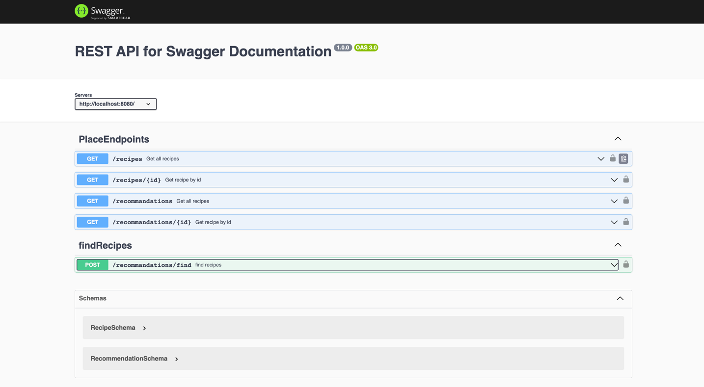
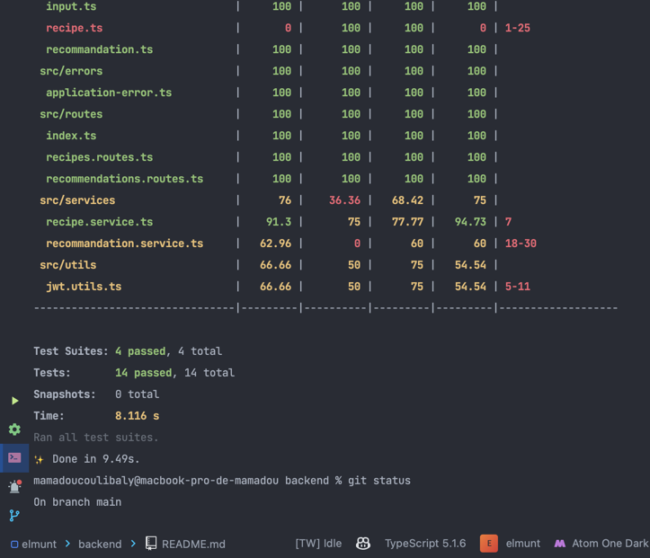

Objectif: Concevoir un système API permettant de lister des recettes et d'obtenir une recommandation personnalisée en fonction de paramètres donnés
Temps estimé : Une demi journée au maximum.

Technologies:
- Typescript obligatoire
- Express obligatoire (vanilla ou NestJS)

liste des routes:
- `GET /recipes` : liste des recettes
- `GET /recipes/{id}` : détail d'une recette
- `GET /recommendations` : liste des recommendations
- `GET /recommendations/{id}` : détail d'une recommendation
- `POST /recommendations/find` : recommandation personnalisée avec les differents recipes avec body params

## Acces au lien avec swagger en local:
- `npm install`
- `npm run start:dev`
- `http://localhost:3000/api-docs`

## illustration image swagger:
__*SWAGGER*__

__*Test Coverage*__

## GIthub action: 
--> **Github action workflow**:   ./github/workflows/build.app.yml

Description:
Il faudra concevoir un système API en respectant les bonnes pratiques: code aéré, réparti correctement entre plusieurs fichiers (contrôleurs, routes, DTOs etc…).
Sans base de données, vous construirez plusieurs modèles pour stocker des informations en statique:

Recipes:
- Recipe slug
- Animal type (dog / cat)
- Recipe name (pork / fish / turkey / chicken)
- Coefficient calorifique

Recommendations:
- Animal type
- Race
- Minimum coef
- Maximum coef
- Recipes slugs

Vous mettrez à disposition plusieurs routes permettants de:
- Lister les entités des deux modèles (GET)
- Afficher le détail d'une entité sur un modèle donné (GET)
- Récupérer une recommendation customisée sur la base d'informations fournies par l'utilisateur: l'animal type, la race et les recettes voulues. La recommandation réalisée devra contenir les recettes données en requêtes, ainsi que leur répartition en fonction du coefficient calorifique. (POST)

Vous pouvez générer les données, les recommandations ainsi que la répartition de manière arbitraire, leur véracité ne faisant pas partie du test. Seules comptent la réflexion et l'implémentation des logiques métier.
De plus, il n'est pas nécessaire de générer une grosse quantité de données. Se limiter à quelques races avec quelques recommandations sur une implémentation intéressante sera mieux qu'une implémentation partielle sur un gros set de données.

Bonus:
- Test unitaire et/ou E2E
- Github action pour déclencher les tests à chaque push